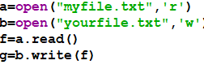
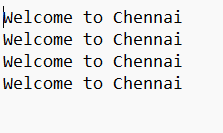

# copy-file
## AIM:
To write a python program for copying the contents from one file to another file.
## EQUIPEMENT'S REQUIRED: 
PC
Anaconda - Python 3.7
## ALGORITHM: 
### Step 1:
open the file myfile.txt in read mode

### Step 2:
open the file yourfile.txt in write mode

### Step 3:
read the file

### Step 4:
write the file into another file

### Step 5:
end the program 

## PROGRAM:
```py
#PROGRAM: Copy - File
#Developed by : MOHAMMAD FAIZAL SK
#Reg no : 212223240092
def copy(filename,newfile):
    with open(filename,'r') as fp:
        with open(newfile,'w') as fp1:
            data1=fp.read()
            fp1.write(data1)
filename=input("Enter an Existing File:")
newfile=input("Enter a name for new file:")
copy(filename,newfile)
```

### OUTPUT:
output




Text File



Copy File


## RESULT:
Thus the program is written to copy the contents from one file to another file.